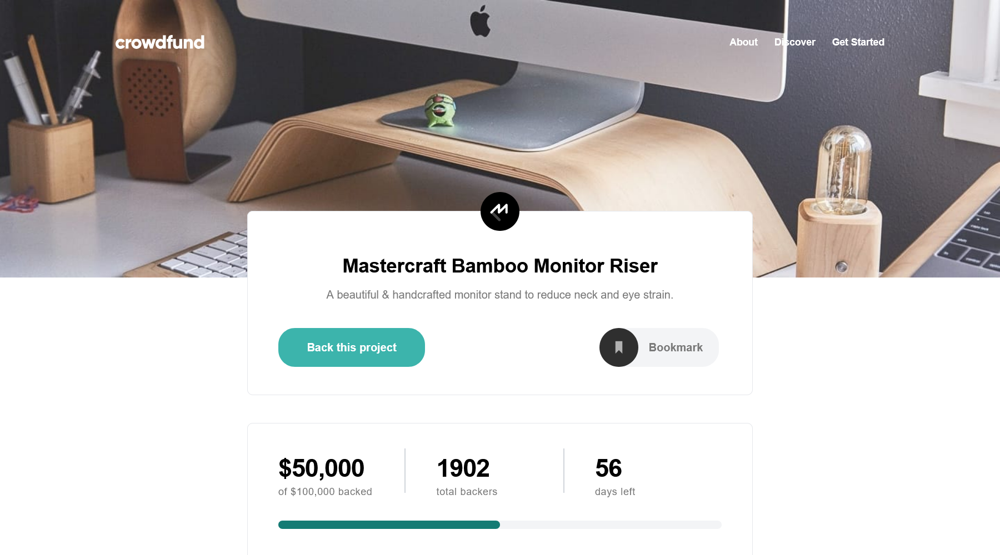

# Frontend Mentor - Crowdfunding product page solution

This is a solution to the [Crowdfunding product page challenge on Frontend Mentor](https://www.frontendmentor.io/challenges/crowdfunding-product-page-7uvcZe7ZR). Frontend Mentor challenges help you improve your coding skills by building realistic projects. 

## Table of contents

- [Overview](#overview)
  - [The challenge](#the-challenge)
  - [Screenshot](#screenshot)
  - [Links](#links)
- [My process](#my-process)
  - [Built with](#built-with)
  - [Continued development](#continued-development)
- [Author](#author)
- [Acknowledgments](#acknowledgments)

## Overview

### The challenge

Users should be able to:

- View the optimal layout depending on their device's screen size
- See hover states for interactive elements
- Make a selection of which pledge to make
- See an updated progress bar and total money raised based on their pledge total after confirming a pledge
- See the number of total backers increment by one after confirming a pledge
- Toggle whether or not the product is bookmarked

### Screenshot

### Links

- Solution URL: [Github](https://github.com/uvdevelop26/crowfunding-product-page)
- Live Site URL: [Github Pages](https://uvdevelop26.github.io/crowfunding-product-page/)

## My process

### Built with

- Semantic HTML5 markup
- Tailwind CSS
- Flexbox
- Mobile-first workflow

### Continued development

I wish to continue learning techniques to improve JavaScript coding. It is important to learn about abstraction to improve readability and order

## Author

- LinkedIn - [Ubaldo Villalba](https://www.linkedin.com/in/ubaldo-villalba-6727a021a/)
- Frontend Mentor - [@uvdevelop26](https://www.frontendmentor.io/profile/uvdevelop26)

